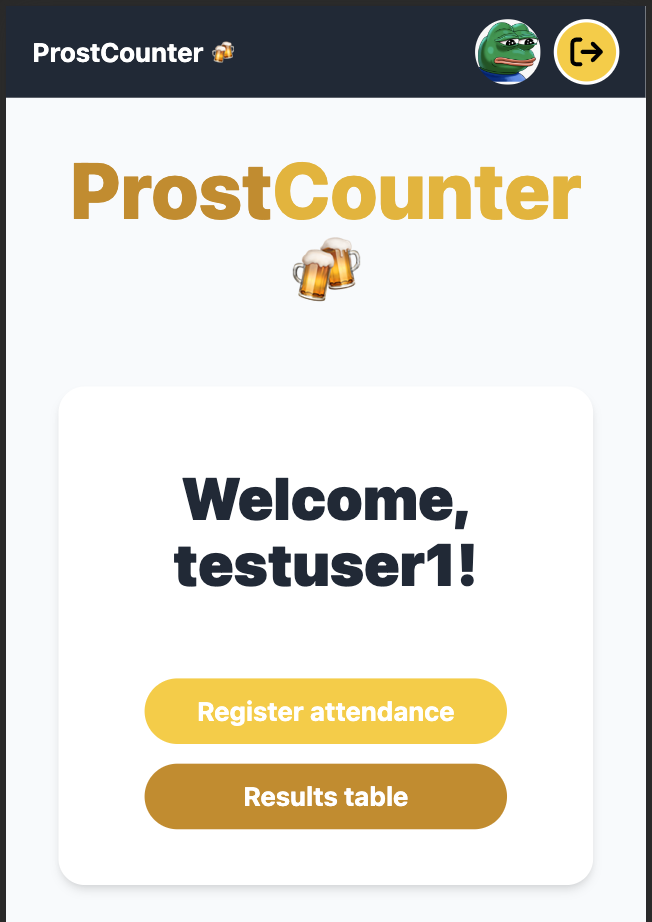

# Oktoberfest attendance registering app: ProstCounter

<picture>
 <source media="(prefers-color-scheme: dark)" srcset="./docs/home-page-screenshot.png">
 <source media="(prefers-color-scheme: light)" srcset="./docs/home-page-screenshot.png">
 
</picture>

## Technologies used

- Frontend:

  - [Next.js](https://github.com/vercel/next.js) - a React framework for production.

- Backend:

  - [Supabase.js](https://supabase.com/) for user management, database and storage.

## Developing locally

### 0. Prerequisites

- [Docker Desktop](https://www.docker.com/products/docker-desktop/) running
- I'm currently using [pnpm](https://pnpm.io/) as a package manager but both `npm` and `yarn` can be used
- Install dependencies: `pnpm install`

### 1. Env vars

Copy `.env.example` or manually create a file in the root folder named `.env.local` with the following variables:

```
NEXT_PUBLIC_SUPABASE_URL=<http://localhost:54321 provided when running supabase start>
NEXT_PUBLIC_SUPABASE_ANON_KEY=<this one is provided when running supabase start>
SUPA_ACCESS_TOKEN=<this one should be asked to the app owner>
```

Populate this file with your URL and Key.

### 2. Run Supabase

Before running the server for the first time, you need to link it to the supabase project. Run the following command:

```bash
supabase link
```

It will ask you for an access token. The `SUPA_ACCESS_TOKEN` is a secret access key that should be asked to the app owner ([@ignaguri](https://github.com/ignaguri)).

The base configuration is already created so you just have to run the following script:

```bash
pnpm sup:start
```

> If the start fails because of unhealthy services, you can run the start command with the following flag, for example for the studio service:

```bash
pnpm sup:start -x studio
```

This will boot up a Docker instance and load the infrastructure.

When it finishes, it will print the credentials needed to fill the `.env.local` file in the terminal.

### 2.1. Run Supabase migrations

When starting the supabase server, the migrations files are automatically run.

You can check the seed files in `./supabase/seed.sql` folder. It automatically creates 10 users with the following credentials, where # is a number from 1 to 10:

```
email: user#@example.com
password: password
```

> [!IMPORTANT]
> This step shouldn't be necessary because when pulling from the repo you should have the migrations files already in your local files.

If you want to sync changes made to the remote DB, you can do it with the following commands:

This will pull the changes from the remote DB

```bash
pnpm sup:db:pull
```

This will reset the local db and run the migrations

```bash
pnpm sup:db:reset
```

This will generate the database typescript types

```bash
pnpm sup:db:types
```

### 3. Run the application

Run the application: `pnpm dev`. Open your browser to `https://localhost:3000/` and you are ready to go 🚀.
# test
# another test
# test commit
# test validation
# test validation 2
# test validation 3
# test validation 4
